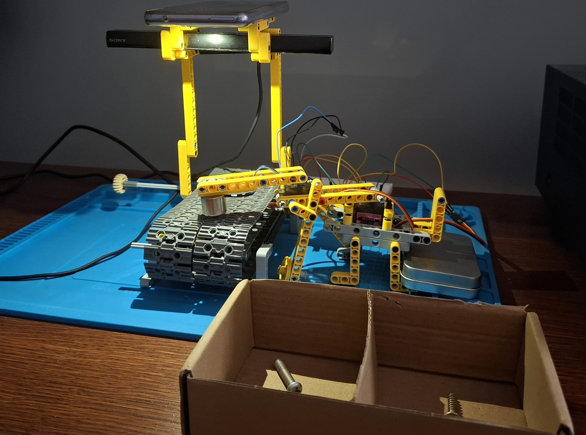
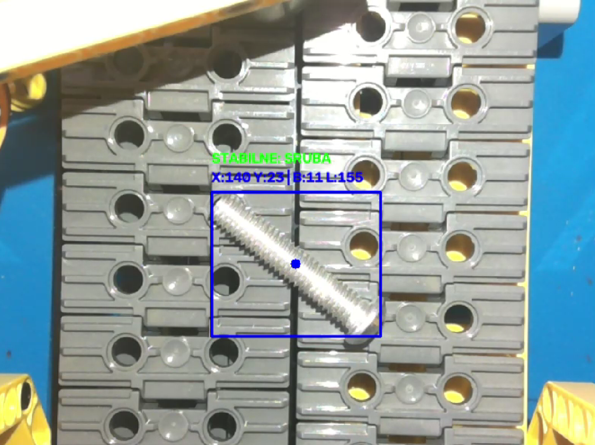

# SCARA-Pick-and-Place-Robot-with-YOLOv8-Vision
This project simulates an automated industrial pick-and-place robot. The physical system is a 2-axis SCARA (Selective Compliance Assembly Robot Arm) built with Lego Technic, operating over a conveyor belt.

## System Hardware & Setup


## Video Demo
https://youtube.com/shorts/hCv5c77dUGY?feature=share

## System Vision Preview (YOLO & Kinematics)


## Tech Stack & Hardware
*   **Computer Vision & AI:** Python, OpenCV (`cv2`), NumPy (for matrix transformations), Ultralytics YOLOv8 (Custom model for fastener classification).
*   **Hardware Control:** C++, Arduino UNO, L293D H-Bridge Motor Driver.
*   **Mechanics & Actuators:** Custom Lego Technic SCARA arm, 2x Servo Motors (Base and Elbow), 5V Electromagnet.
*   **Power Management:** External 7V to 5V DC Step-Down module to safely isolate servo/magnet power from the Arduino logic.
*   **Communication:** PySerial (9600 baud rate).

## Key Engineering Features

1.  **Coordinate Transformation (Homography):**
    The system uses a pre-calibrated perspective transformation matrix (`homografia.npy`) to convert camera pixel coordinates into precise physical coordinates (X, Y in millimeters) on the conveyor belt plane.
2.  **Inverse Kinematics & Dynamic Parallax Correction:**
    Custom trigonometric algorithms calculate the exact joint angles required for the 2-link arm to reach the target. A dynamic software offset is implemented to correct camera parallax errors caused by the 3D height of the screw heads when they are far from the camera's center.
3.  **Settling Time Logic (Stabilization Filter):**
    To avoid tracking noise and moving targets, the Python script acts as a state machine. It measures the Euclidean distance of the object between frames and triggers the robot's movement only if the object remains stationary within a 3mm tolerance for at least 1.0 second.
4.  **Power Management & Sequential Homing:**
    To prevent voltage drops (brownouts) when multiple heavy loads activate simultaneously, the Arduino code utilizes a sequential movement algorithm (`sekwencyjnyRuch`). Additionally, a dedicated "Park" command (`P`) ensures the robot safely folds into a rigid home position before shutdown, preventing violent startup twitches.
5.  **Magnetic Compliance & Demagnetization Trick:**
    The electromagnet is driven by an L293D H-Bridge, protecting the Arduino from inductive flyback. To ensure the fastener drops instantly upon reaching the sorting bin, the code applies a brief 50ms reverse-polarity pulse (demagnetization) to break residual magnetic fields before cutting the power completely.

## How to Run It

### 1. Hardware Setup
1.  Connect the Base Servo to `PIN 9` and Elbow Servo to `PIN 10` on the Arduino.
2.  Connect the L293D H-Bridge control pins to `PIN 4` and `PIN 5`.
3.  Ensure the servos and electromagnet are powered by an **external 5V power supply** with shared GND to the Arduino.
4.  Upload `arduino_scara_arm.ino` to the board.
5.  Ensure the Serial Monitor is closed.

### 2. Software Setup
1.  Clone this repository.
2.  Install the required dependencies:
    ```bash
    pip install opencv-python ultralytics pyserial numpy
    ```
3.  Ensure your custom YOLO model (`best.pt`) and calibration matrix (`homografia.npy`) are in the same directory as the script.
4.  Adjust the `PORT_COM` variable in `scara_main.py` (e.g., `'COM5'`) to match your Arduino connection.
5.  Run the script:
    ```bash
    python scara_main.py
    ```
6.  Press `q` in the vision window to safely park the arm and exit the program.
